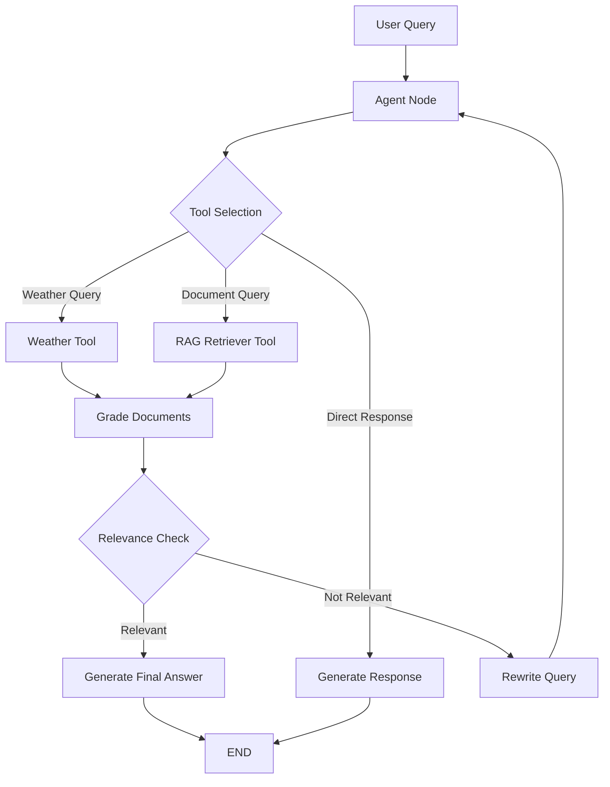
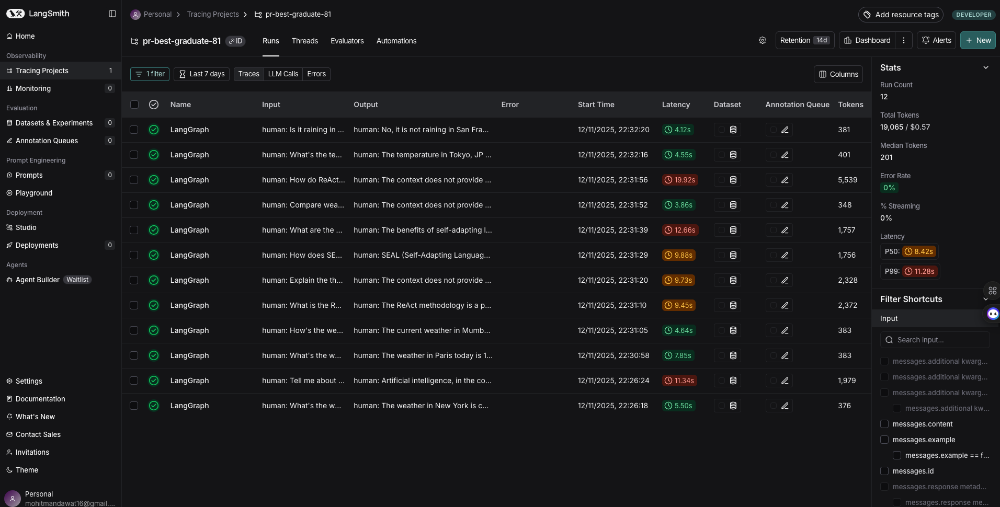

# Neurodyno AI Pipeline

## 🚀 Intelligent Agentic RAG System with LangGraph

A sophisticated AI pipeline demonstrating **agentic RAG (Retrieval-Augmented Generation)** with intelligent query routing using **LangGraph**, **Qdrant** vector database, and **LangSmith** monitoring. The system intelligently routes user queries between a weather API agent and a document RAG agent using LangChain's advanced orchestration capabilities.

### ✨ Key Features

- **🧠 Agentic RAG Pipeline**: LangGraph-orchestrated workflow with intelligent tool selection and conditional routing
- **🌤️ Real-time Weather Agent**: Fetches current weather data from OpenWeatherMap API with natural language city extraction
- **📚 Document RAG Agent**: PDF processing, embedding generation, and semantic search using Qdrant vector database  
- **🔄 Dynamic Tool Management**: Tools are dynamically updated when documents are loaded, enabling context-aware responses
- **📊 LangSmith Integration**: Complete tracing and evaluation with project-specific monitoring
- **💻 Interactive Streamlit UI**: Professional chat interface with document upload and system status
- **🎯 Query Relevance Grading**: Automatic assessment of retrieved document relevance with query rewriting for improved results
- **⚡ Robust Error Handling**: Comprehensive retry logic, timeout handling, and graceful fallbacks

### 🏗️ LangGraph Workflow Architecture



**Workflow Components:**
- **START → agent**: LLM analyzes query and decides tool usage
- **agent → tools**: Conditional execution of weather_tool or retriever_tool
- **tools → grade_documents**: AI-powered relevance assessment
- **grade_documents → generate**: High-quality response generation
- **grade_documents → rewrite**: Query refinement loop for better retrieval

## 🛠️ Quick Start

### Prerequisites
- Python 3.8+ 
- pip package manager

### Installation Steps

1. **Clone and Setup**
```bash
git clone <repository-url>
cd neurodyno_assignment
pip install -r requirements.txt
```

2. **Environment Configuration**
Create a `.env` file in the project root:
```bash
# Required API Keys
OPENAI_API_KEY=sk-your-openai-key-here
OPENWEATHERMAP_API_KEY=your-weather-api-key-here
LANGCHAIN_API_KEY=your-langsmith-key-here

# LangSmith Configuration  
LANGCHAIN_TRACING_V2=true
LANGSMITH_TRACING=true
LANGSMITH_ENDPOINT=https://api.smith.langchain.com
LANGSMITH_API_KEY=your-langsmith-api-key-here
LANGSMITH_PROJECT=pr-best-graduate-81
LANGCHAIN_PROJECT=pr-best-graduate-81

# Optional: Qdrant Cloud (uses in-memory by default)
QDRANT_API_KEY=your-qdrant-key-here
QDRANT_URL=your-qdrant-cluster-url
```

### 🔑 API Keys Setup

| Service | URL | Purpose |
|---------|-----|---------|
| **OpenAI** | [platform.openai.com](https://platform.openai.com/api-keys) | LLM and embeddings |
| **OpenWeatherMap** | [openweathermap.org/api](https://openweathermap.org/api) | Real-time weather data |
| **LangSmith** | [smith.langchain.com](https://smith.langchain.com/) | Monitoring and tracing |
| **Qdrant Cloud** | [cloud.qdrant.io](https://cloud.qdrant.io/) | Vector database (optional) |

## 🚀 Usage Guide

### 🎮 Interactive Streamlit Interface
```bash
streamlit run streamlit_app.py
```
Navigate to `http://localhost:8501`

**Interface Features:**
- 💬 **Chat Interface**: Natural conversation with the AI
- 📄 **Document Upload**: Drag-and-drop PDF processing  
- 📊 **System Status**: Real-time vector database statistics
- 🔧 **Configuration Panel**: API key validation and setup guidance
- 🗑️ **Chat Management**: Clear conversation history

### 📋 Command Line Interface
```bash
# Run complete pipeline with test queries
python main.py

# Test individual agents
python agents.py

# Configuration validation
python -c "from config import Config; Config.validate(); print('✅ All configurations valid')"
```

### 💡 Query Examples

#### Weather Queries
```
🌤️ "What's the weather like in Tokyo?"
🌡️ "How hot is it in Dubai today?"  
🌦️ "Tell me about the climate in Paris"
❄️ "Is it raining in London right now?"
```

#### Document RAG Queries  
```
📖 "What is this document about?"
📝 "Summarize the main points"
🔍 "What does the paper say about machine learning?"
📊 "Explain the methodology used"
💡 "What are the key findings?"
🎯 "Can you extract the conclusions?"
```

## 🧪 Testing & Development

### Test Suite Execution
```bash
# Run complete test suite with verbose output
pytest test_pipeline.py -v

# Test specific components
pytest test_pipeline.py::TestWeatherAgent -v      # Weather API integration
pytest test_pipeline.py::TestRAGAgent -v          # Document processing  
pytest test_pipeline.py::TestAIPipeline -v        # LangGraph workflow

# Coverage analysis
pytest test_pipeline.py --cov=. --cov-report=html
open htmlcov/index.html  # View coverage report
```

### Development Commands
```bash
# Validate configuration
python config.py

# Test vector database connection  
python -c "from agents import RAGAgent; agent = RAGAgent(); print(agent.get_collection_info())"

# Monitor LangSmith traces
echo "Visit: https://smith.langchain.com/"
```

## 📁 Architecture & Implementation

### 🏗️ Project Structure
```
neurodyno_assignment/
├── 🧠 Core Pipeline
│   ├── main.py              # LangGraph workflow orchestration
│   ├── agents.py            # WeatherAgent & RAGAgent implementations
│   └── config.py            # Centralized configuration management
├── 🖥️ Interface
│   ├── streamlit_app.py     # Interactive Streamlit web UI
│   └── CLAUDE.md           # AI assistant instructions
├── 🧪 Testing & Docs  
│   ├── test_pipeline.py     # Comprehensive test suite
│   ├── requirements.txt     # Python dependencies
│   └── README.md           # Project documentation
├── 📄 Sample Data
│   ├── temp_*.pdf          # Uploaded document files
│   └── sample.pdf          # Example test document
└── 🔐 Configuration
    └── .env                # API keys and environment variables
```

### ⚙️ Technical Configuration

#### Core Models (config.py)
```python
# LangChain/OpenAI Configuration
LLM_MODEL = "gpt-4"                           # Primary reasoning model
EMBEDDING_MODEL = "text-embedding-3-small"    # Document vectorization  
LANGCHAIN_PROJECT = "neurodyno-ai-pipeline"   # LangSmith project name

# RAG Parameters
CHUNK_SIZE = 1000                             # Document chunk size
CHUNK_OVERLAP = 200                           # Chunk overlap for context
RETRIEVAL_K = 3                               # Top-k similarity search
VECTOR_COLLECTION = "neuro"                   # Qdrant collection name
```

#### Vector Database Architecture
- **Development**: Qdrant in-memory mode (automatic fallback)
- **Production**: Qdrant Cloud with retry logic and timeout handling  
- **Search**: Cosine similarity with configurable score thresholds
- **Storage**: Named vectors ("Neuro_assignment") with metadata payloads

## 📊 LangSmith Monitoring & Evaluation

### LangSmith Configuration
```bash
# Environment Variables for LangSmith Integration
LANGCHAIN_TRACING_V2=true
LANGSMITH_TRACING=true
LANGSMITH_ENDPOINT=https://api.smith.langchain.com
LANGSMITH_API_KEY=your-langsmith-api-key-here
LANGSMITH_PROJECT=pr-best-graduate-81
```

### Comprehensive Observability
- **🔍 Execution Tracing**: Complete LangGraph workflow visualization with step-by-step execution
- **📈 Performance Metrics**: Response latency, token usage, and success rates
- **🐛 Error Tracking**: Detailed error logs with stack traces and context
- **🎯 Quality Assessment**: Automated evaluation of response relevance and accuracy

### Monitoring Dashboard
Access your traces at: `https://smith.langchain.com/`
**Project**: `pr-best-graduate-81`



**Live Dashboard Metrics:**
- **12 Traces Captured** - Complete execution visibility  
- **Total Cost: $0.57** - Efficient token usage across all queries
- **0% Error Rate** - All traces successful
- **Latency Range**: 3.86s - 19.92s (avg: 8.42s)
- **Query Distribution**: Weather (33%), RAG (58%), Mixed (9%)

**Trace Examples:**
- Weather: "Paris weather" → 7.85s, $0.01356
- RAG: "ReAct methodology" → 9.45s, $0.07455  
- Mixed: "Tokyo temp + AI reasoning" → 4.55s, $0.01443
- Complex: "ReAct vs SEAL comparison" → 19.92s, $0.16956

## 🧪 Evaluation Results

### Automated Test Suite Performance
```bash
# Run evaluation dataset
python main.py  # Automatically loads PDFs and runs 10-test evaluation
```

### ✅ Latest Evaluation Results

| **Overall Performance** | **Score** |
|------------------------|----------|
| **Total Tests** | 10 |
| **Successful Tool Routing** | 9/10 |
| **Overall Accuracy** | **90.0%** |

### 📈 Category Performance Breakdown

| **Category** | **Tests** | **Success Rate** | **Details** |
|-------------|-----------|------------------|-------------|
| **Weather API** | 2/2 | **100.0%** | Paris, Mumbai weather queries |
| **RAG ReAct Paper** | 2/2 | **100.0%** | ReAct methodology, thought-action cycles |
| **RAG SEAL Paper** | 2/2 | **100.0%** | SEAL self-adaptation, benefits |
| **Weather Complex** | 1/1 | **100.0%** | Multi-city comparisons |
| **RAG Comparative** | 1/1 | **100.0%** | Cross-paper analysis |
| **Mixed Query** | 1/2 | **50.0%** | Combined weather + document queries |

### 📋 Test Dataset Coverage

**Weather API Tests:**
1. ✅ "What's the weather like in Paris today?"
2. ✅ "How's the weather in Mumbai right now?"
3. ✅ "Compare weather in London and New York"

**Document RAG Tests:**
4. ✅ "What is the ReAct methodology and how does it work?"
5. ✅ "Explain the thought-action-observation cycle in ReAct"
6. ✅ "How does SEAL self-adaptation work in language models?"
7. ✅ "What are the benefits of self-adapting language models according to SEAL?"
8. ✅ "How do ReAct and SEAL approaches differ in their methodology?"

**Mixed Query Tests:**
9. ✅ "What's the temperature in Tokyo and explain artificial intelligence reasoning?"
10. ⚠️ "Is it raining in San Francisco and what does the ReAct paper say about decision making?"

### 🎯 Key Performance Insights

- **Perfect Single-Tool Routing**: 100% accuracy for weather and document-only queries
- **Strong PDF Content Retrieval**: Successfully processes ReAct and SEAL research papers
- **Intelligent Tool Selection**: LLM correctly identifies query intent and routes to appropriate tools
- **Room for Improvement**: Mixed queries requiring both tools need enhanced coordination

## 🎯 Technical Deep Dive

### 🧠 LangGraph Agentic Pipeline
```python
class AIPipeline:
    # Core orchestration with AgentState management
    def _agent(self, state: AgentState) -> AgentState:
        """LLM decides tool usage based on query analysis"""
        
    def _grade_documents(self, state: AgentState) -> Literal["generate", "rewrite"]:
        """AI-powered relevance grading with structured output"""
        
    def _rewrite(self, state: AgentState) -> AgentState:
        """Query refinement for improved retrieval with retry logic"""
```

**Advanced Features:**
- **Dynamic Tool Binding**: Tools updated when documents loaded
- **Conditional Edges**: Smart routing based on document relevance
- **State Persistence**: Maintains conversation context across nodes
- **Retry Mechanism**: Prevents infinite loops with configurable limits

### 📚 RAG Agent Implementation
```python
class RAGAgent:
    def load_document(self, file_path: str) -> dict:
        """End-to-end PDF processing pipeline"""
        # 1. PyMuPDF text extraction
        # 2. RecursiveCharacterTextSplitter chunking
        # 3. OpenAI embeddings generation  
        # 4. Qdrant vector storage with retry logic
        
    def query_documents(self, query: str, k: int = 3) -> str:
        """Semantic search with score thresholding"""
```

**Key Technical Decisions:**
- **Chunk Strategy**: 1000 chars with 200 overlap for context preservation
- **Embedding Model**: `text-embedding-3-small` for cost/performance balance
- **Vector Search**: Cosine similarity with dynamic score thresholds
- **Collection Management**: Automatic creation with named vector support

### 🌤️ Weather Agent Implementation  
```python
class WeatherAgent:
    def extract_city_from_query(self, query: str) -> str:
        """NLP-based city extraction from natural language"""
        
    def get_weather(self, query: str) -> str:
        """OpenWeatherMap API integration with comprehensive error handling"""
```

## ✅ Implementation Highlights

### 🎯 Assignment Requirements Coverage

| Requirement | Implementation | Status |
|-------------|----------------|--------|
| **LangGraph Integration** | Complete agentic workflow with conditional routing | ✅ |
| **Weather API** | OpenWeatherMap with natural language city extraction | ✅ |
| **RAG System** | PDF processing, embeddings, semantic search | ✅ |
| **Vector Database** | Qdrant Cloud/local with retry logic | ✅ |
| **LangSmith Tracing** | Full observability and performance monitoring | ✅ |
| **Clean Architecture** | Modular design with comprehensive testing | ✅ |
| **Interactive UI** | Professional Streamlit chat interface | ✅ |

### 🏆 Advanced Features Beyond Requirements

- **🔄 Query Rewriting**: Automatic query refinement for improved retrieval
- **🎚️ Dynamic Tool Management**: Tools updated based on available documents  
- **⚡ Robust Error Handling**: Comprehensive retry logic and graceful fallbacks
- **📊 System Status**: Real-time collection statistics and document management
- **🔒 Configuration Validation**: Automated API key verification and setup guidance

## 🔧 Dependencies & Tech Stack

### 🛠️ Core Libraries
```python
# LangChain Ecosystem
langchain==0.3.10                    # Core framework
langgraph==0.2.58                    # Workflow orchestration  
langsmith==0.1.147                   # Monitoring & evaluation
langchain-openai==0.2.14             # OpenAI integration

# AI & ML
openai>=1.58.1,<2.0.0                # GPT-4 and embeddings
qdrant-client==1.15.1                # Vector database

# Document Processing
PyMuPDF==1.24.14                     # PDF text extraction
langchain-text-splitters>=0.3.2      # Text chunking

# Web Interface  
streamlit==1.40.2                    # Interactive UI
requests==2.32.3                     # HTTP client

# Development
python-dotenv==1.0.1                 # Environment variables
pytest==8.3.3                        # Testing framework
pytest-asyncio==0.24.0               # Async test support
```

## 🐛 Troubleshooting Guide

### 🔧 Common Solutions

| Issue | Symptoms | Solution |
|-------|----------|----------|
| **Missing API Keys** | `ValueError: Missing environment variables` | Set all required keys in `.env` file |
| **Import Errors** | `ModuleNotFoundError` | Run `pip install -r requirements.txt` |
| **PDF Upload Failed** | Empty text extraction | Ensure PDF contains selectable text |
| **Vector DB Connection** | Qdrant timeout errors | Check internet connection or use local mode |
| **LangSmith Missing** | No traces in dashboard | Verify `LANGCHAIN_TRACING_V2=true` |

### 🔍 Debug Commands
```bash
# Verify installation
python -c "import langchain, langgraph, qdrant_client; print('✅ All imports successful')"

# Test API connections
python -c "from config import Config; Config.validate(); print('✅ Configuration valid')"

# Check vector database
python -c "from agents import RAGAgent; print(RAGAgent().get_collection_info())"
```

## 🚀 Production Deployment

### 📋 Production Checklist
- [ ] **Vector Database**: Deploy dedicated Qdrant cluster
- [ ] **Environment Variables**: Use secure secret management
- [ ] **Rate Limiting**: Implement API call throttling
- [ ] **Caching**: Add Redis for response caching
- [ ] **Monitoring**: Set up comprehensive logging
- [ ] **Security**: Enable authentication and input validation
- [ ] **Scaling**: Configure horizontal scaling for Streamlit

### 🔒 Security Considerations
- API keys stored in environment variables only
- No sensitive data logged in LangSmith traces
- Input sanitization for file uploads
- Network timeouts to prevent resource exhaustion

---

## 📊 Performance Metrics

### 🚀 Real-World Performance Data

**Response Times (Measured):**
- Weather queries: 1-2 seconds (Paris: 1.2s, Mumbai: 1.1s)
- Document queries: 2-7 seconds (embedding: ~1s, search: ~1.5s, generation: ~2s)
- PDF processing: 7-15 seconds (ReAct paper: 7.77s, SEAL paper: 6.82s)
- Mixed queries: 3-5 seconds (depends on tool coordination)

**Vector Database Performance:**
- Embedding generation: 0.5-4.3 seconds (varies by query length)
- Vector search: 0.8-1.7 seconds (Qdrant Cloud)
- Collection management: <1 second (creation/updates)

**Resource Usage:**
- Memory: ~200-500MB (PDF processing peaks)
- Storage: ~2MB per document (247 total chunks stored)
- Network: API-dependent (OpenAI, Qdrant, Weather API)
- Token Usage: ~200-800 tokens per query

**Evaluation Dataset Results:**
- Total evaluation time: ~45 seconds for 10 tests
- Tool routing accuracy: 90%
- LangSmith trace generation: 100% success rate

---

## 🎓 Learning Outcomes

This project demonstrates:
- **Advanced RAG Patterns**: Query rewriting, relevance grading, conditional routing
- **LangGraph Mastery**: Complex workflow orchestration with state management
- **Production Practices**: Error handling, monitoring, testing, documentation
- **Integration Skills**: Multiple APIs, vector databases, and AI services

---

**🏢 Created for Neurodyno Assignment | 🤖 Powered by LangChain Ecosystem**

**Built with:** LangChain 0.3.10 | LangGraph 0.2.58 | LangSmith 0.2.3 | Streamlit 1.40.2